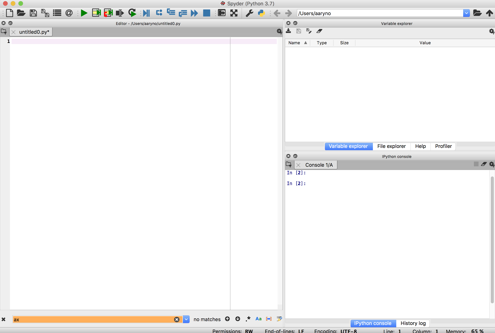
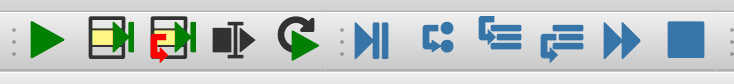

# Python Spatial Programming with Geopandas
## Assignment

### Background
We previously worked with python within the framework of QGIS but python is most flexible when used in stand-alone mode, which allows us to decouple the QGIS framework libraries from the base libraries of python and explicitly add libraries of our own. As with other languages, the power of Python comes from the plethora of high-quality libraries that extend the base functionality of the core python programming language. In the realm of spatial python there are many libraries but we will start with a couple: `geopandas`, `shapely`, `rasterio`, and `rasterstats`. 

#### GeoPandas
Read this [tutorial](https://geopandas.org/getting_started/introduction.html)
Browse/read the GeoPandas [user guide](https://geopandas.org/docs/user_guide.html). This will be a reference for you in this and later assignments. 

- Tutorial: https://geopandas.org/getting_started/introduction.html
- User Guide: https://geopandas.org/docs/user_guide.html

#### Anaconda and Spyder
Python relies on libraries that extend the basic functionality. These libraries are installed and managed primarily by two different methods. `pip` may be more familiar to you if you have used python previously. `conda` is what we will use because it manages dependencies better and the conda library repos (aka `channels`) support the geospatial libraries better than `pip`'s `PyPi`.

#### Integrated Development Environment (IDE) - Spyder
When developing code or working with structured files in HTML, JSON, YAML, etc., it is helpful to use a special type of text editor that does syntax highlighting as well as more advanced functions such as being able to complete typing commands or variables because they are context-aware as well as have integrations with runtimes. For this class we will be using `Spyder`, an IDE for Python that includes smart editing, integrated runtime, and a variable explorer, allowing you to visually inspect your variables as you are running through your program. Like the geospatial libraries, this is a python library with its own dependencies and I have wrapped it up in the same docker container. Since it is a Graphical User Interface (GUI), it has special requirements for building windows and interacting with your mouse and keyboard that are slightly morecomplicated running through docker so we are going to be running them inside a browser. 

#### Geospatial libraries and notes on documentation 
Geospatial Library Reference:
- [Shapely docs](https://shapely.readthedocs.io/en/stable/manual.html)
- [Geopanda docs](http://geopandas.org/)

Docs can be good or bad. The docs for above range from "ok" to "good" (geopandas).
GeoPandas actually uses the `shapely` model for geometries and while it needs to be installed, there is little direct
interaction with this library on our part except for accessing the `shapely` geometries.

### Prerequisites
- Anaconda installed with Python 3.7

### Directions

#### Anaconda environment setup

Launch Anaconda Navigator and select "Environments". We are going to create a new environment for this assignment. 
Click the "Create" button to create a new environment. Name it "geo-3.7"
On the right side of Navigator is a list of installed libraries. Change the drop-down from `installed` to `All`, then search for "geopandas".
If it doesn't show up, make sure that the `All` is selected in the drop-down.
Click on the open box next to the name of the package to select it for download. Then, at the bottom of the panel, click on the green `Apply` button.

Do the same for `rasterio`. In the end, you will have installed the following libraries:
- `geopandas`
- `rasterio`

After installing the geospatial libraries in the `geo-3.7` environment, click on the big `Home` button at the top-left of the Navigator window to take you back to Navigator home where the applications are listed. In the drop-down next to `Applications On`, select the `geo-3.7` Environment. Next, find the icon labeled `Spyder` and click `Install`. Once it's installed, the `Install` button will change to a `Launch` button.

#### Launch Spyder from Anaconda 
Making sure to have the `geo-3.7` environment selected, launch `Spyder`.
This is what your Spyder IDE looks like:
 
 
 
Notice the three panels. In the large panel on the left (labeled `Editor`) you can write python code and take notes. In the 
top right `Variable explorer`) you can see what variables are in scope and inspect their types and contents. In the bottom 
right ('iPython console') is an interactive python console. You can type python directly into the console or use the icons 
at the top of the `Editor` panel to send commands to the python console. Of note, the Gear icon in the console title bar
will allow you to restart the "`kernel`", which restarts python and gives you a fresh environment (with no declared 
variables or libraries imported).

In practice, it is good to use the `Editor` window to build a working program line by line, saving your progress as a new
python file, and then, after significant edits, restarting the kernel and running through the program line by line to make 
sure it works from start to finish.

The editor has a navigation bar that allows you to run a selection, a line, or the entire program:

#### Follow GeoPandas Intro Exercise
Follow the [Geopandas Getting Started Introduction](https://geopandas.org/getting_started/introduction.html), taking screenshots 
of your workspace at the following parts of the intro:

- `screencap-workspace-gdf.png` -> workspace showing `gdf` after reading `nybb` from file
- `screencap-gdf-dist.png` -> workspace showing contents of a `GeoDataFrame` showing distances from the first one
- `screencap-gdf-centroids.png` -> plot showing just the centroid locations
- `screencap-gdf-buffered-centroid.png` -> plot showing buffered centroids

### Deliverables
Include the 4 screenshots as files in a new branch named `geopandas` and create a new Pull Request to join `geopandas` with `master` _but do not merge it yourself_.
